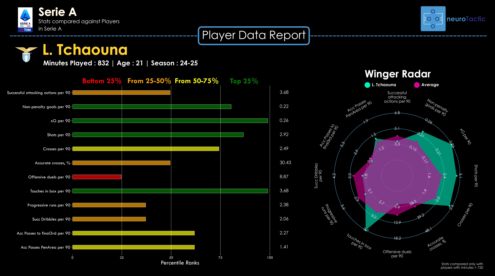
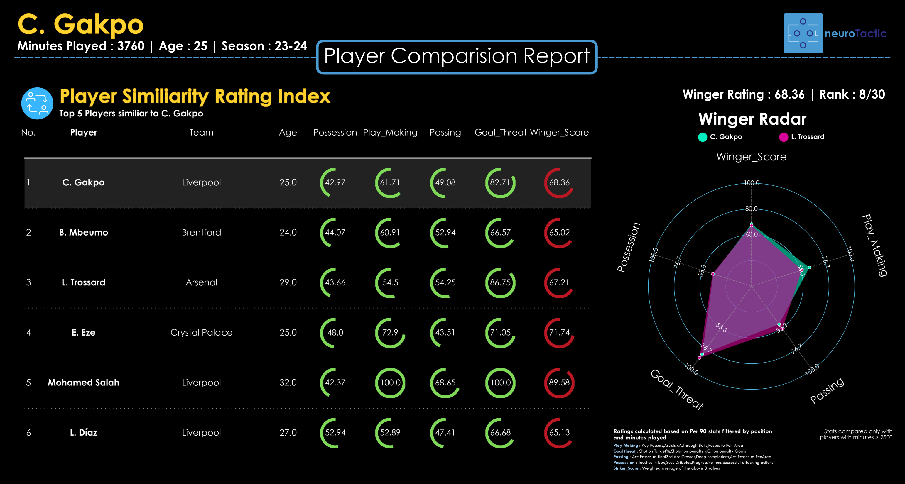

# NRT-Player-Data-Report

   &nbsp &nbsp

# Project Background
 Neurotactic specializes in data-driven football analysis, offering insights for individual players, clubs, and national teams. Our expertise helps optimize performance, strategy, and decision-making by leveraging advanced analytics to unlock the full potential of players and teams. Earlier, we used to make player reports using Tableau and I was tasked with created an automated quick report generator.

# Details
- Used for ad-hoc analysis as required by our team's player performance analyst.
- Increased efficiency by reducing the time needed to create reports compared to manually building them in Tableau.
- Made using Python and libraries such as Pandas and Matplotlib.
- 
# Data Structure & Initial Checks

The data used in from Wyscout. It is tabular with multiple columns containing different type of player stats.

### 1. Player Data Report
   Data from Wyscout. Used to identify key player strengths, and visualize their standout attributes.
   
  - **Key Features**

    Filtering: Select player positions and apply filters for age and minutes played.
    
    Statistical Analysis: Compute percentile and z-scores for each statistic.
    
    Visualization: Generate bar and radar plots for highlighting a player's best stats.
   

   &nbsp &nbsp

### 2. Player Comparision Report

  Data from Wyscout. Can find player strengths, calculates aggregate statistics, and finds similar players represented by a similarity score. 
   
  - **Key Features**

    Statistical Analysis: Compute percentile ranks, z-scores, and aggregate stats using custom-weighted combinations of individual stats.
    
    Player Comparison: Use cosine similarity to find players with similar performance profiles.
    
    Visualization: Generate table and radar plots for comparision of stats.
   

   &nbsp &nbsp

